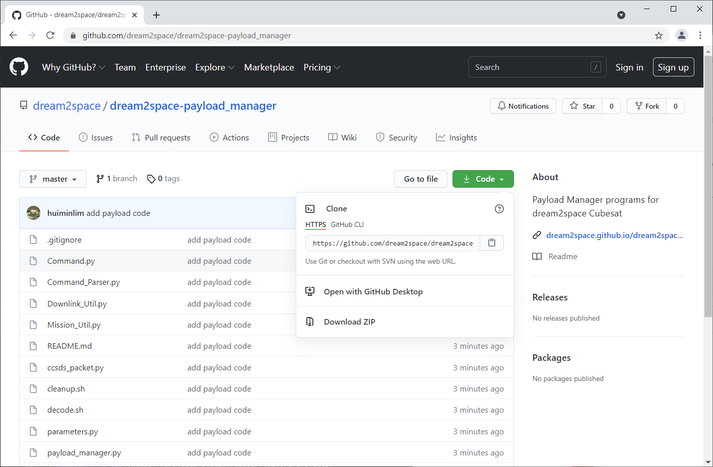
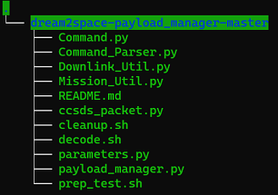

# Payload Setup

This documentation describes the setup for the Raspberry Pi off the package for the Payload.

The Payload uses a Raspberry Pi 3B+ credit card sized computer.


## Step 1: Insert micro SD card

| 💡 | **Ensure that the Raspberry Pi and entire Cubesat is not powered up when carrying out this step.**                                                                                                                                      |
| -  | --------------------------------------------------------------------------------------                                                    |

Ensure that the micro SD card provided in the package is inserted into the Raspberry Pi.

The micro SD card slot can be found on the side of the Raspberry Pi as shown in the image below.


| ⚠️  | **Always ensure that the Raspberry Pi is shutdown properly as the SD card is prone to data corruption if shutdown is not done properly.** |
| -- | :----------------------------------------------------------------------------------------------------------------------------------------- |

The micro SD card comes pre-loaded with the necessary setup to be done to run the Payload.

| 💡 | **If there are any data corruption and/or SD card does not boot up as expected, refer to the Appendix for information on how to reset the SD card.**                                                                                                                                      |
| -  | :--------------------------------------------------------------------------------------                                                    |

## Step 2: Power up the Raspberry Pi

Power up the Cubesat and the Raspberry Pi according to the hardware guide.

## Step 3: Access the Raspberry Pi

As the Raspberry Pi is a mini computer, there are several ways to access the Raspberry Pi and view the screens like a regular PC.

Here are some of the ways, depending on which is the most suitable and convenient method for you.

Here are some suggestions.

|                                                             | Methods                | Best used when                                                                |
| ----------------------------------------------------------- | ---------------------- | ----------------------------------------------------------------------------- |
| [3a](#step-3a-access-raspberry-pi-using-hdmi-and-mouse)     | HDMI Display and mouse | When you have a monitor and mouse lying around                                |
| [3b](#step-3b-access-raspberry-pi-via-sshvnc-over-ethernet) | SSH/VNC over Ethernet  | When your PC has an ethernet port and you have an ethernet cable lying around |
| [3c](#step-3c-access-raspberry-pi-via-wifi)                 | WiFi                   | When you have WiFi access                                                     |

We will go through each method in detail and click on your preferred method for the next step.

## Step 3a: Access Raspberry Pi using HDMI and Mouse

| 💡 | **This is the recommended method to work on in the NUS labs.**                                                                                                                                      |
| -  | :--------------------------------------------------------------------------------------                                                    |

Connect the monitor to the Raspberry Pi using the HDMI cable.


Connect a mouse and keyboard to the Raspberry Pi via the USB port.

| 💡 | **Ensure that the Payload transceiver's USB adapter is connected into the Raspberry Pi prior to connecting other USB devices.**                                                                                                                                      |
| -  | :--------------------------------------------------------------------------------------                                                    |


Check that the Monitor displays the Desktop screen of the Raspberry Pi and the USB mouse and keyboard are detected successfully.

Click [here](#step-4-copy-the-payload-manager-code-over-to-the-raspberry-pi) to proceed to the next step.

## Step 3b: Access Raspberry Pi via SSH/VNC over Ethernet

### For Windows

SSH, or Secure Shell Protocol, is a method to access the Raspberry Pi remotely.

To do so, the Raspberry Pi needs to join your laptop's network and this is done via a direct Ethernet connection.

Plug in the Ethernet cable to the Raspberry Pi's Ethernet port.


Connect the other side of the Ethernet cable to the laptop's Ethernet port.

Go to the Laptop's Network Connection and set the Ethernet to obtain IP addresses automatically.


Share the Laptop's WiFi to the Raspberry Pi.


To verify if the setup is done correctly, open a serial terminal such as `Putty` and key the hostname into the terminal as shown below.


An example of the terminal screen that will appear is shown below.


Initially, the login screen will appear to prompt for login credentials. Login with the default account credentials:

```bash
username: pi
password: raspberry
```

Upon successful login, the terminal will show the green words `pi@raspberrypi`.

Click [here](#step-4-copy-the-payload-manager-code-over-to-the-raspberry-pi) to proceed to the next step.

### For Mac

In progress

## Step 3c: Access Raspberry Pi via WiFI

In progress.

Click [here](#step-4-copy-the-payload-manager-code-over-to-the-raspberry-pi) to proceed to the next step.

## Step 4: Copy the Payload Manager code over to the Raspberry Pi

Download the Payload Manager program from the link [here](https://github.com/dream2space/dream2space-payload_manager).

Click on the green `Code` button and download the code as a ZIP file.



Unzip the downloaded ZIP file and extract the folder.

Copy out the folder that contains the programs into a thumbdrive.

Ensure that the folder copied into the thumbdrive is a single folder (not a folder in another folder) that contains the following files.



Rename the folder as `dream2space-payload_manager`

Copy the folder into the `Desktop` folder of the Raspberry Pi via a drag and drop.

## Step 5: Setup the Raspberry Pi Python libraries

Open up a terminal by clicking on the `Terminal` icon at the task bar or pressing `Ctrl+Alt+T` on the keyboard.


Type the following into the terminal to change the directory the terminal is currently at to the Payload Manager code folder and press enter to execute the command.

```bash
cd Desktop/payload-manager-lite
```

Type in the two commands sequentially to install all the libraries required.

```bash
chmod 777 install.sh
./install.sh
```

When prompted to install libraries, type `Y` to install.

## Step 6: Run the Payload Manager code

Once the setup is completed, run the Payload Manager code by issuing the command in the terminal.

```bash
python3 payload_manager.py
```
