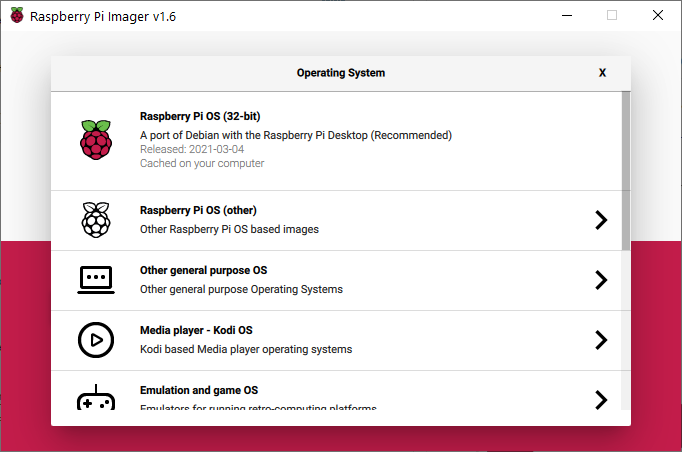

# Appendix - Setup Raspberry Pi SD card

This documentation describes the setup for the Raspberry Pi SD card for the Payload.

## Step 1: Install Raspbian OS

Download the Raspberry Pi Imager from the website [here](https://www.raspberrypi.org/software/).

Install the Raspberry Pi Imager and launch the Application once installed. The application looks like this.


Click `Choose OS` and select the recommended first option, `Raspberry Pi OS (32-bit)`.



Insert the MicroSD card into the PC and click `Choose Storage` to flash the OS onto under the `Storage` tab.

Select the storage volume to flash the OS onto.


Wait for the flashing to complete.

## Step 2: Set up the SD Card to enable SSH

Remove and insert the SD card into the PC again.

Enter the `boot` drive that the PC detects.

Create an empty file name `ssh` in `boot`.

This is done by going through the right click menu and creating a file as such.


## Step 4: Boot up the Raspberry Pi

Boot up the Raspberry Pi and wait for a few minutes until the Yellow LED remains stable for around 5 minutes.

## Step 5: Access the Raspberry Pi

Using any of the methods described in the main document, access the Raspberry Pi.

## Step 5: Enable VNC UART interfaces

Type `sudo raspi-config` into the terminal to enter the configuration screen to start VNC.

Navigate to the Interface options and press enter.


Navigate to the VNC option and press enter.


Select yes to enable VNC.


Leave the configuration page by selecting Finish.


When prompted to reboot, selected yes and wait for 5 minutes until the Yellow LED stabilizes after 5 minutes.

### Step 6: Enable Camera interface

Use `sudo raspi-config` to enter the configuration screen to enable the camera interface.

Similar to the previous step, navigate to the Interface options and press enter.

Select Camera option and press enter.


Select yes and press enter.


Similarly, leave the configuration page by selecting finish.

When prompted to reboot, selected yes and wait for 5 minutes until the Yellow LED stabilizes after 5 minutes.

### Step 7: Use VNC

Use VNC to view the GUI desktop of the Raspberry Pi.

Enter `raspberrypi.local` into the top bar to connect to the Raspberry Pi via VNC.


Once entered into the GUI, enter the default username and password.

### Step 8: Set up UART

Source: [here](https://www.raspberrypi.org/documentation/configuration/uart.md) and [here](https://www.circuits.dk/setup-raspberry-pi-3-gpio-uart/)

Open up the terminal and issue the following command.

```bash
dmesg | grep tty
```

The following screen should be observed, with the `PL011` connected to the `ttyAMA01`.


Issue the `sudo raspi-config` command and navigate to the `Interface Options` and then to `Serial Port`, the press enter.


When prompted about the login shell over console, select No.


When prompted about enabling hardware serial, select Yes.


Exit the configuration page and reboot.

Once the reboot is successful, issue the following command into the terminal.

```bash
sudo nano /boot/config.txt
```

Add these 2 lines to the end of the file if they are not already there.

```bash
enable_uart=1
core_freq=250
```


Press `Ctrl+X`, `Y` and enter to save and exit the file.

Proceed to reboot the Raspberry Pi for changes to take effect.
