# User Guide - SD Card Mass Production

This User Guide is meant for persons who are mass producing the SD card for dream2space Cubesat's payload.

## Step 1: Flashing the Raspbian OS to SD card

1. Download and install the Raspberry Pi Imager application from the website [here](https://www.raspberrypi.org/software/).

    Website: <https://www.raspberrypi.org/software/>

    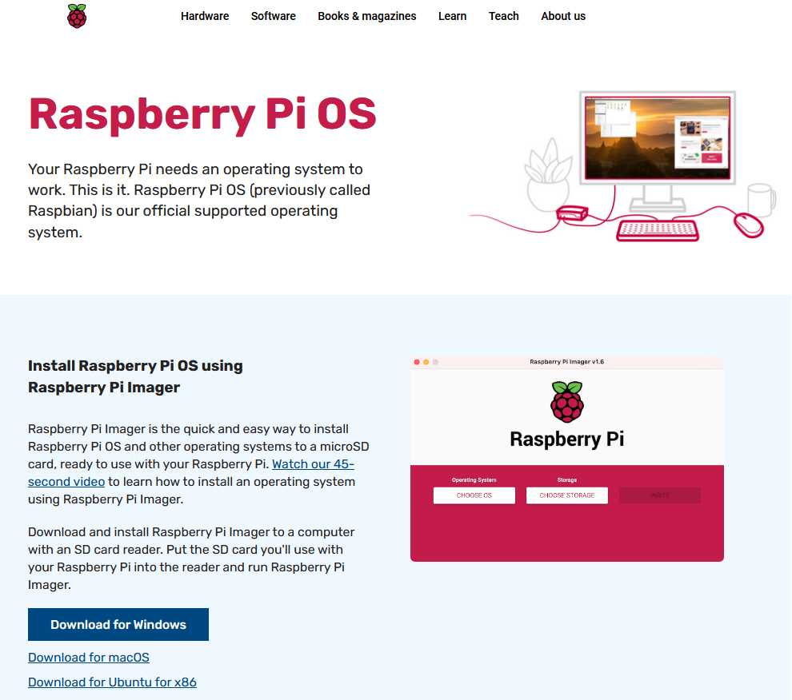

2. Launch the Raspberry Pi Imager application.

    The Imager application should look like this:

    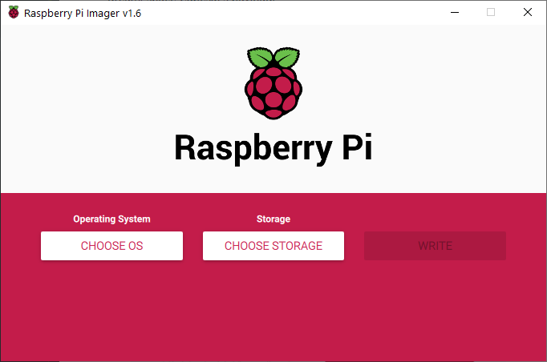

3. Click on the `Choose OS` button under the `Operating System` section.

    The `Choose OS` button is boxed in **<span style="color: green">green</span>** in the image below.

    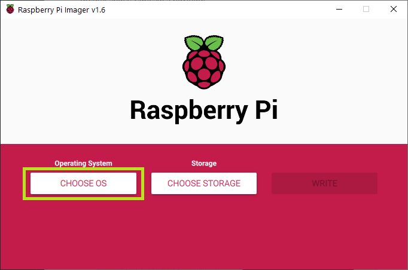

4. Select the first option, `Raspberry Pi OS (32-bit)`.

    The first option `Raspberry Pi OS (32-bit)` is boxed in **<span style="color: green">green</span>** in the image below.

    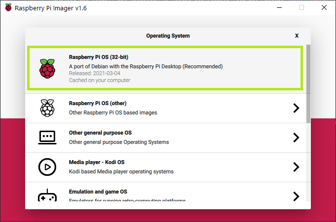

5. Click on the `Choose Storage` button under the `Storage` section.

    The `Choose Storage` button is boxed in **<span style="color: green">green</span>** in the image below.

    


6. Click on the SD Card storage to flash the OS onto.

    | ⚠️ | **To prevent overwriting your other drives, it is recommended to eject all drives before inserting the SD Card.** |
    | - | -------------------------------------------------------------------------------------- |

    For example, the SD Card detected is shown and boxed  in **<span style="color: green">green</span>** in the image below.

    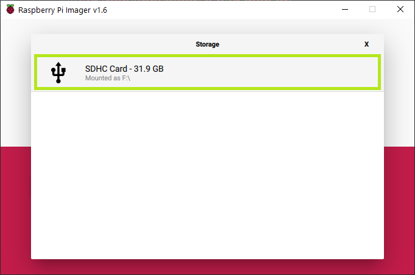

7. Click on the `Write` button to begin the flashing.

    The `Write` button is boxed in **<span style="color: green">green</span>** in the image below.

    

    Click `Yes` to overwrite the SD Card.

    The `Yes` button is boxed in **<span style="color: green">green</span>** in the image below.

    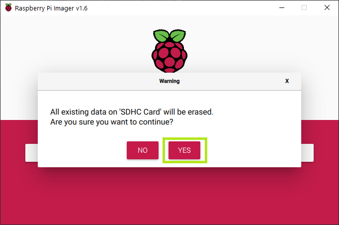

8. Wait for the OS write process to complete.

    Upon completion, click the `Continue` button boxed in **<span style="color: green">green</span>** in the image below.

    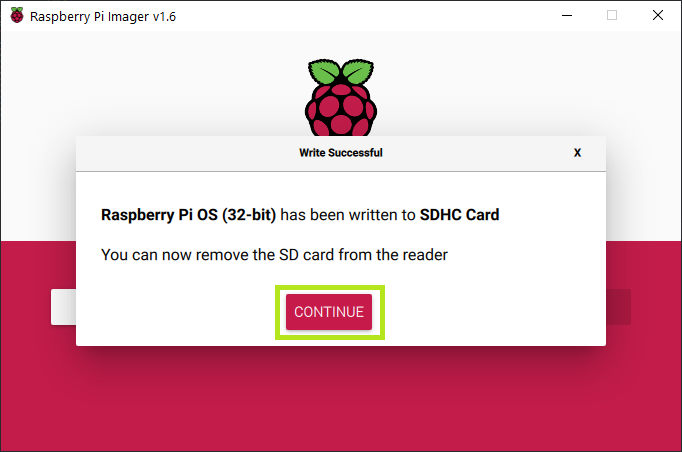

9. Eject the SD Card and re-insert the SD Card into the PC again.

    Open the `File Explorer` and go to `This PC`.

    A `boot` drive should appear after re-insering the SD Card.

    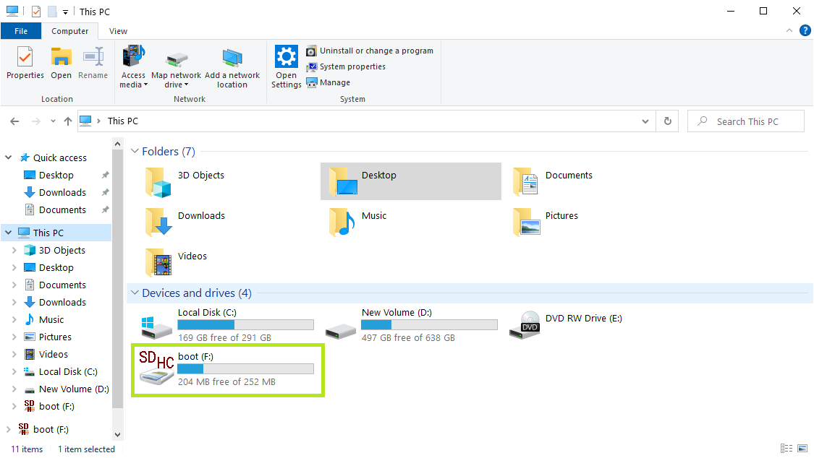

## Step 2: Copy Custom Setup scripts to the SD Card

1. Click on the `boot` drive in `File Explorer`.

    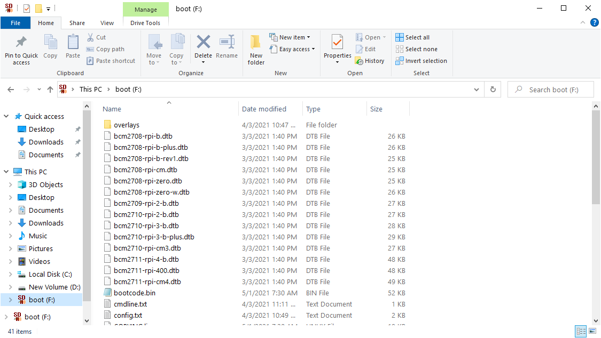

2. Download and copy the config scripts into the `boot` drive.

    The config scripts can be downloaded from here:

    - [payload_config.sh](assets/mass-production/payload_config.sh)
    - [system_setup.sh](assets/mass-production/system_setup.sh)
    - [wpa_supplicant.conf](assets/mass-production/wpa_supplicant.conf)

    Once the copying is complete, the 3 files should appear like in the image below.

    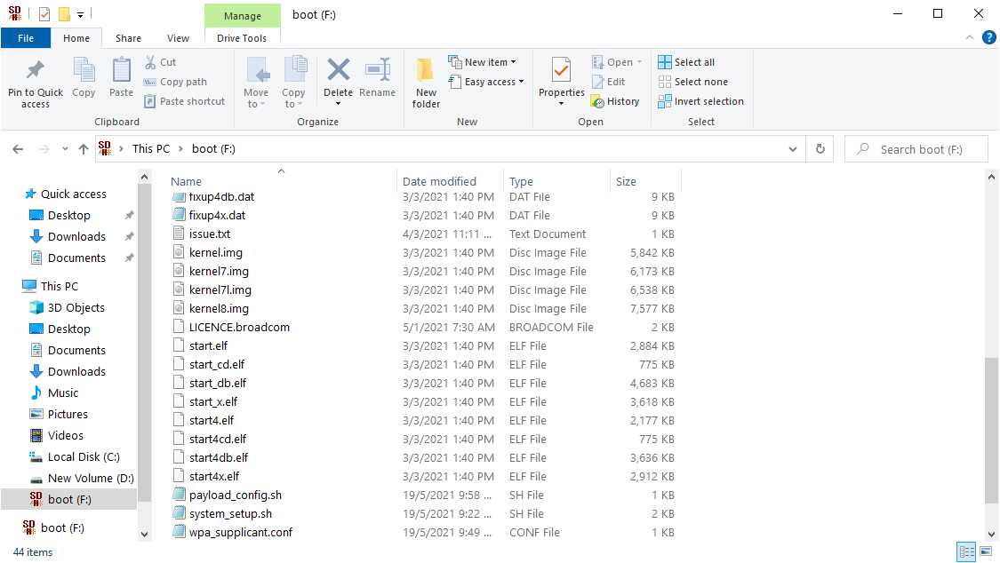

## Step 3: Configure WiFi credentials to the Raspberry Pi OS

1. Locate the `wpa_supplicant.conf` file in the `boot` drive and open it using Notepad.

    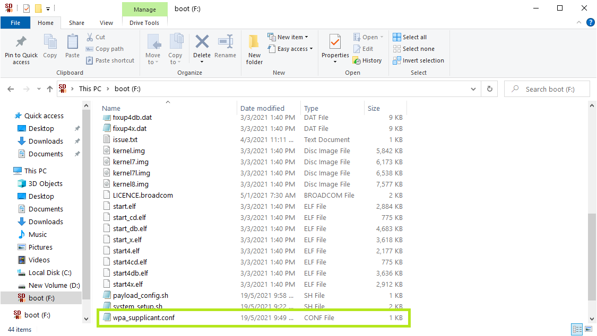

2. Fill in the template with the WiFi Router name and the Password.

    Save the changes in the file.

    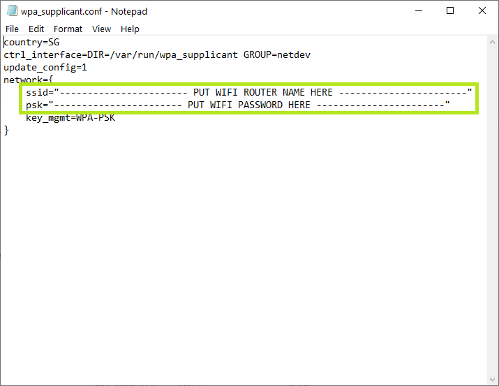

## Step 4: Enable SSH in the Raspberry Pi OS

1. Download an empty `ssh` file from the link [here](assets/mass-production/ssh).

2. Copy the file into the `boot` drive.

    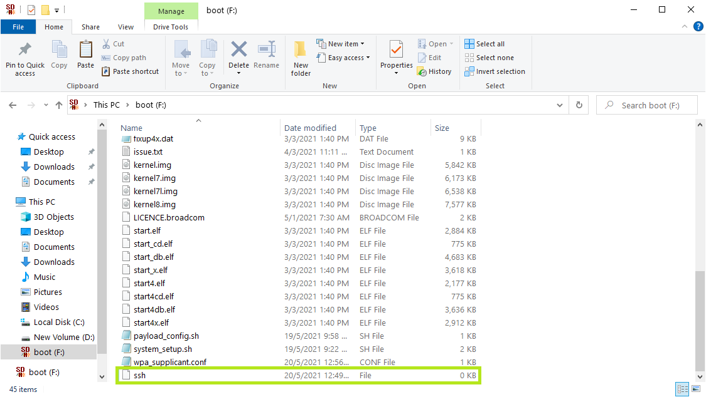

## Step 5: Boot up Raspberry Pi

## Step 6: SSH into Raspberry Pi

1. Ensure that PuTTY is installed on the PC.

    You may download PuTTY from this website [here](https://www.chiark.greenend.org.uk/~sgtatham/putty/latest.html)

    Website: <https://www.chiark.greenend.org.uk/~sgtatham/putty/latest.html/>

2. Open up PuTTY and SSH into PuTTY.

    To SSH into PuTTY, enter `raspberrypi.local` into the `Host Name (or IP address)` box boxed in **<span style="color: green">green</span>** in the image below.

    Ensure that the `Port` entered is `22` (by default).

    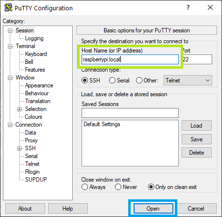

    Click `Open`, which is boxed in **<span style="color: blue">blue</span>** in the image.

3. Login to the Raspberry Pi when prompted.

    The default credentials for Raspberry Pi login are here:

    ```bash
    username: pi
    password: raspberry
    ```

    After entering the username and password individually (and sequentially), press `Enter` to confirm.

    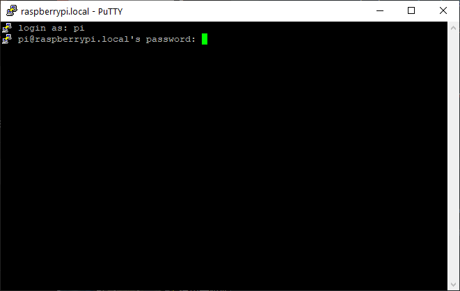

    If the login is successful, the screen below will appear.

    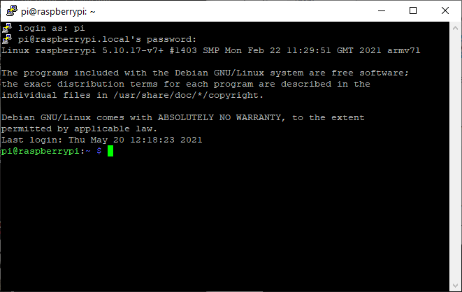

## Step 7: Run Custom Setup scripts in Raspberry Pi

1. Run the `payload_config.sh` script that is saved in the `boot` drive to install the libraries and Payload Manager code.

    To do so, type the following command into the PuTTY terminal and press `Enter`:

    ```bash
    sudo /boot/payload_config.sh
    ```

    The `payload_config.sh` script will run and wait till its completion.

    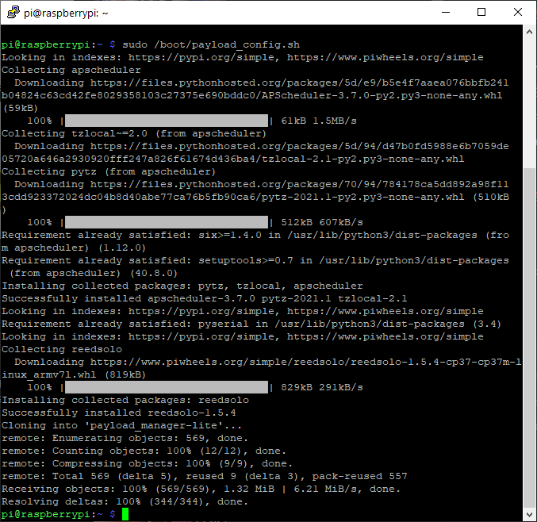

2. Run the `system_setup.sh` script that is saved in the `boot` drive to setup the Raspberry Pi.

    To do so, type the following command into the PuTTY terminal and press `Enter`.

    ```bash
    sudo /boot/system_setup.sh
    ```

    The `system_setup.sh` script will run and wait till its completion.

    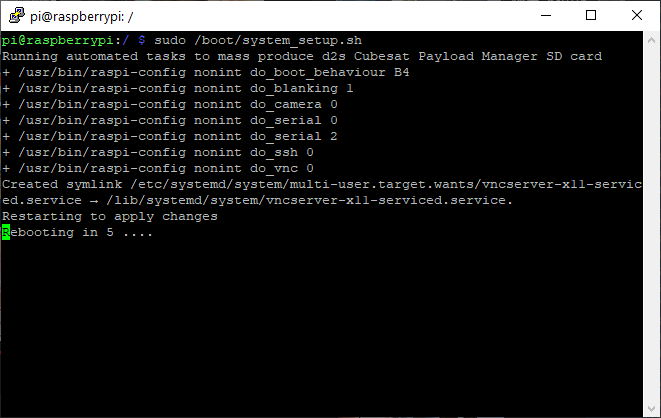

    Upon its completion, the Raspberry Pi will reboot and the PuTTY terminal connection will be disconnected.

    Close the PuTTY terminal.

## Step 8: View GUI of the Raspberry Pi

## Step 9: Configure the GUI settings
