# User Guide - SD Card Mass Production

This User Guide is meant for persons who are mass producing the SD card for dream2space Cubesat's payload.

## Items required

Here is a list of items required for the mass production of SD Card.

| Items                               | Remarks                                                                                    |
| ----------------------------------- | ------------------------------------------------------------------------------------------ |
| Raspberry Pi 3B+                    |                                                                                            |
| SanDisk 32 GB Ultra Micro SD Card   |                                                                                            |
| SD Card Reader                      | Optional, depends on PC type so that <br>Micro SD Card may be inserted into PC             |
| Raspberry Pi Micro-USB Power Supply |                                                                                            |
| Monitor                             |                                                                                            |
| HDMI Cable                          | HDMI on one side, and the other side <br>depends on the input required by the Monitor used |
| USB Keyboard                        | Can be wired or wireless                                                                   |
| USB Mouse                           | Can be wired or wireless                                                                   |

Setup and operations best done on a PC that runs on Windows 10.

## Step 1: Flashing the Raspbian OS to SD card

1. Download and install the Raspberry Pi Imager application from the website [here](https://www.raspberrypi.org/software/).

    Website: <https://www.raspberrypi.org/software/>

    

2. Launch the Raspberry Pi Imager application.

    The Imager application should look like this:

    

3. Click on the `Choose OS` button under the `Operating System` section.

    The `Choose OS` button is boxed in **<span style="color: lime">green</span>** in the image below.

    

4. Select the first option, `Raspberry Pi OS (32-bit)`.

    The first option `Raspberry Pi OS (32-bit)` is boxed in **<span style="color: lime">green</span>** in the image below.

    

5. Click on the `Choose Storage` button under the `Storage` section.

    The `Choose Storage` button is boxed in **<span style="color: lime">green</span>** in the image below.

    


6. Click on the SD Card storage to flash the OS onto.

    | ⚠️ | **To prevent overwriting your other drives, it is recommended to eject all drives before inserting the SD Card.** |
    | - | -------------------------------------------------------------------------------------- |

    For example, the SD Card detected is shown and boxed  in **<span style="color: lime">green</span>** in the image below.

    

7. Click on the `Write` button to begin the flashing.

    The `Write` button is boxed in **<span style="color: lime">green</span>** in the image below.

    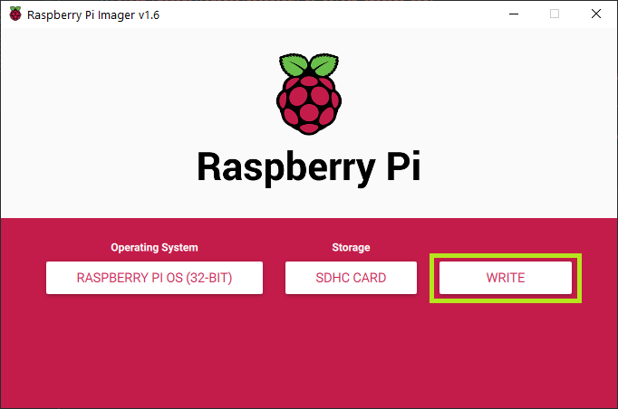

    Click `Yes` to overwrite the SD Card.

    The `Yes` button is boxed in **<span style="color: lime">green</span>** in the image below.

    

8. Wait for the OS write process to complete.

    Upon completion, click the `Continue` button boxed in **<span style="color: lime">green</span>** in the image below.

    

9. Eject the SD Card and re-insert the SD Card into the PC again.

    Open the `File Explorer` and go to `This PC`.

    A `boot` drive should appear after re-insering the SD Card.

    

## Step 2: Copy Custom Setup scripts to the SD Card

1. Click on the `boot` drive in `File Explorer`.

    

2. Download and copy the config scripts into the `boot` drive.

    The config scripts can be downloaded from here:

    - [payload_config.sh](assets/mass-production/payload_config.sh)
    - [system_setup.sh](assets/mass-production/system_setup.sh)
    - <a href="assets/mass-production/wpa_supplicant.conf" download>wpa_supplicant.conf</a>


    Once the copying is complete, the 3 files should appear like in the image below.

    

## Step 3: Configure WiFi credentials to the Raspberry Pi OS

1. Locate the `wpa_supplicant.conf` file in the `boot` drive and open it using Notepad.

    

2. Fill in the template with the WiFi Router name and the Password.

    Save the changes in the file.

    

## Step 4: Enable SSH in the Raspberry Pi OS

1. Download an empty `ssh` file from the link [here](assets/mass-production/ssh).

2. Copy the file into the `boot` drive.

    

## Step 5: Boot up Raspberry Pi

Power up the Raspberry Pi.

## Step 6: SSH into Raspberry Pi

1. Ensure that PuTTY is installed on the PC.

    You may download PuTTY from this website [here](https://www.chiark.greenend.org.uk/~sgtatham/putty/latest.html)

    Website: <https://www.chiark.greenend.org.uk/~sgtatham/putty/latest.html/>

2. Open up PuTTY and SSH into PuTTY.

    To SSH into PuTTY, enter `raspberrypi.local` into the `Host Name (or IP address)` box boxed in **<span style="color: lime">green</span>** in the image below.

    Ensure that the `Port` entered is `22` (by default).

    

    Click `Open`, which is boxed in **<span style="color: blue">blue</span>** in the image.

3. Login to the Raspberry Pi when prompted.

    The default credentials for Raspberry Pi login are here:

    ```bash
    username: pi
    password: raspberry
    ```

    After entering the username and password individually (and sequentially), press `Enter` to confirm.

    

    If the login is successful, the screen below will appear.

    

## Step 7: Run Custom Setup scripts in Raspberry Pi

1. Run the `payload_config.sh` script that is saved in the `boot` drive to install the libraries and Payload Manager code.

    To do so, type the following command into the PuTTY terminal and press `Enter`:

    ```bash
    sudo /boot/payload_config.sh
    ```

    The `payload_config.sh` script will run and wait till its completion.

    

2. Run the `system_setup.sh` script that is saved in the `boot` drive to setup the Raspberry Pi.

    To do so, type the following command into the PuTTY terminal and press `Enter`.

    ```bash
    sudo /boot/system_setup.sh
    ```

    The `system_setup.sh` script will run and wait till its completion.

    

    Upon its completion, the Raspberry Pi will reboot and the PuTTY terminal connection will be disconnected.

    Close the PuTTY terminal.

## Step 8: View GUI of the Raspberry Pi

1. Plug in a HDMI cable to the Raspberry Pi and connect the HDMI cable to a Monitor.

    The HDMI port is boxed in **<span style="color: red">red</span>** in the image below.

    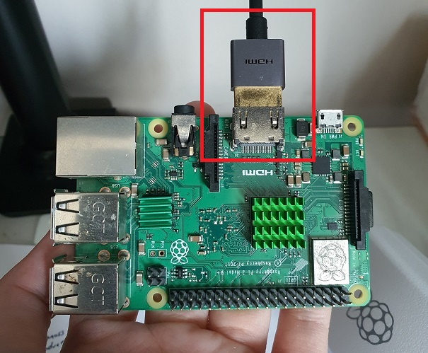

    Connect the USB keyboard and USB mouse to the Raspberry Pi's USB ports.

    

2. Switch to the HDMI source to view the Raspberry Pi GUI.

    Upon successful viewing of the GUI, the following screen will show:

    

## Step 9: Configure the GUI settings

1. Click on the `Next` button to proceed with the setup.

    The `Next` button is boxed in **<span style="color: lime">green</span>** in the image below.

    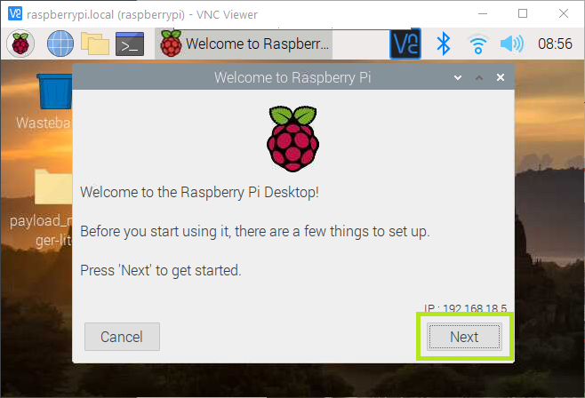

2. Select the Country, Language and Timezone.

    Select the following settings:

    ```bash
    Country:    Singapore
    Language:   English
    Timezone:   Singapore
    ```

    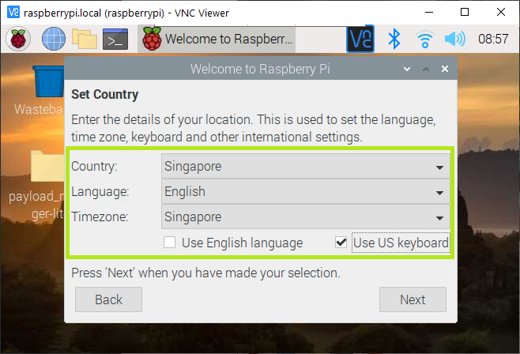

    Click the `Next` button to proceed.

3. Configure the password for the Raspberry Pi OS.

    Use the standardized password:

    ```bash
    password: nus
    ```

    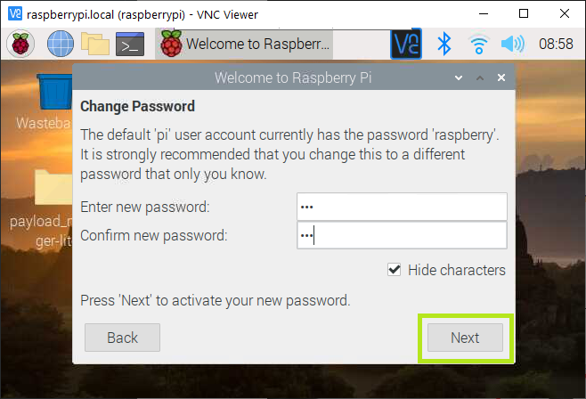

    Click the `Next` button to proceed.

4. Click the `Next` button to skip setting the Screen configurations.

    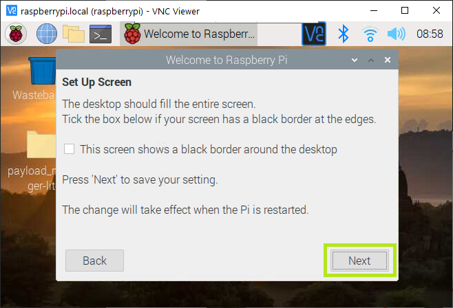

5. Click the `Skip` button to skip configuring the WiFi.

    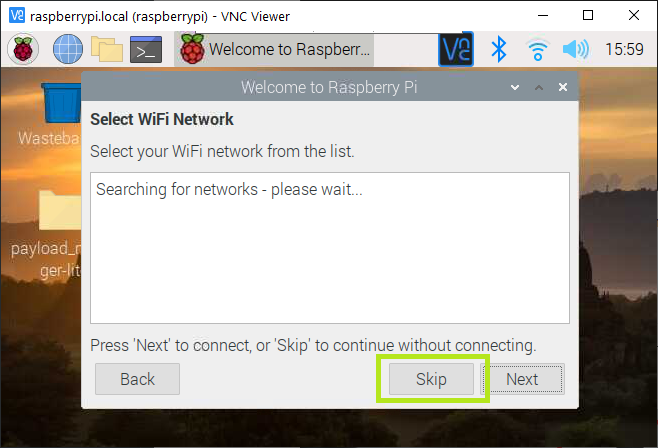

6. Click the `Skip` button to skip updating the OS.

    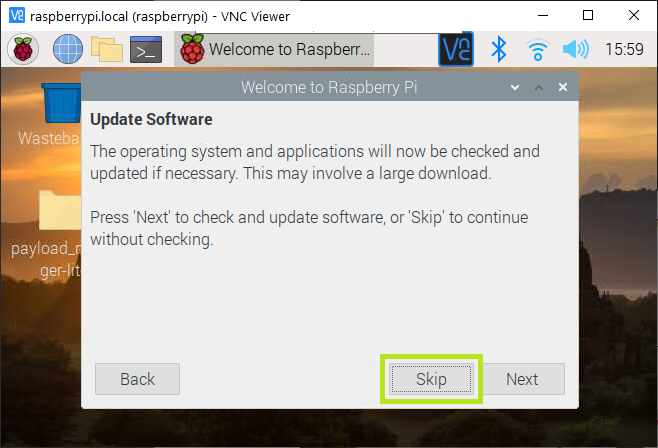

7. Click `Done` to complete setup.

    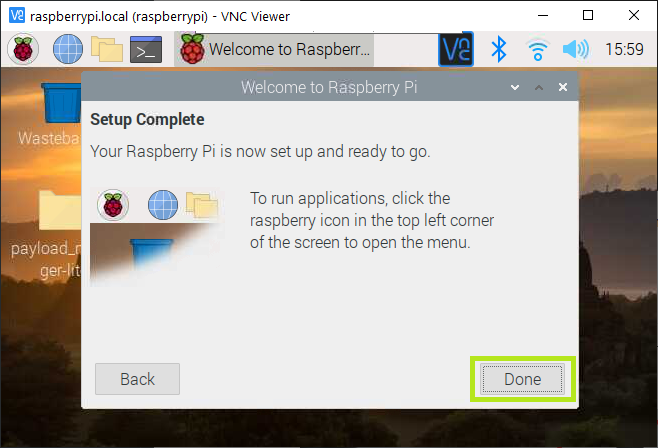


8. Click on the WiFi Logo at the top right hand corner to delete the WiFi credentials entered into the Raspberry Pi previously.

    Click on the currently connected WiFi to delete it.

    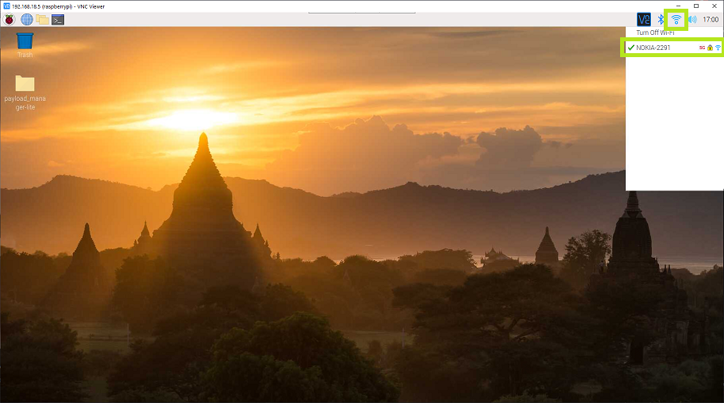

    Click the `Forget` button, which is boxed in **<span style="color: lime">green</span>** in the image below.

    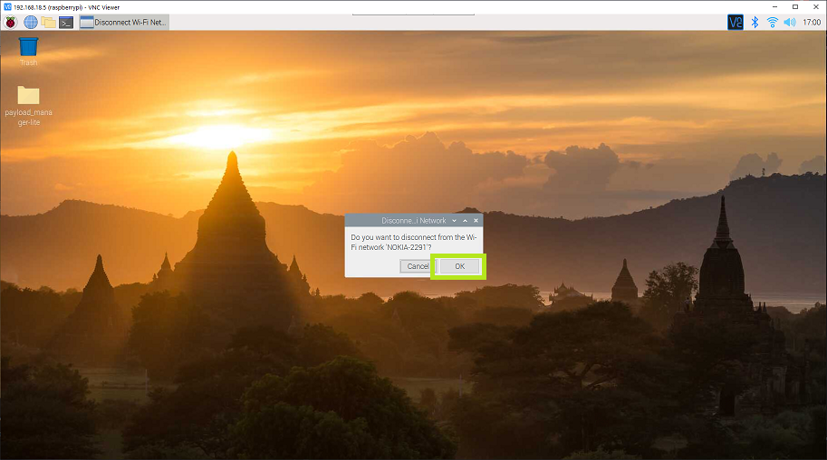

9. Shutdown the Raspberry Pi.

    To navigate to the Shutdown menu, click on the Raspberry Pi Logo at the top left hand corner and click the `Logout` button.

    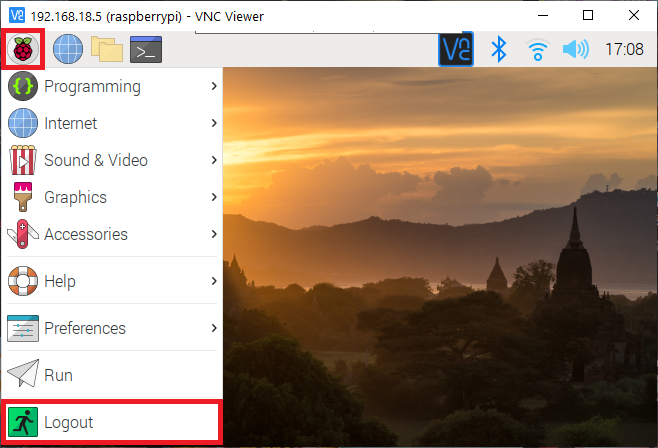

    Select `Shutdown` to shutdown the Raspberry Pi safely.

    