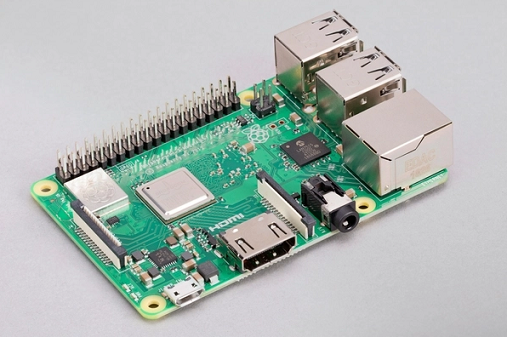
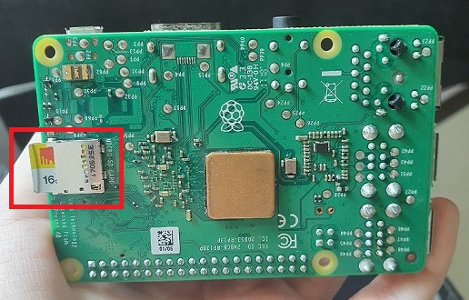
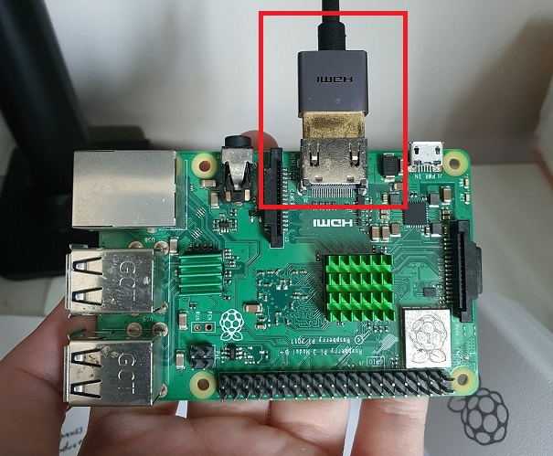
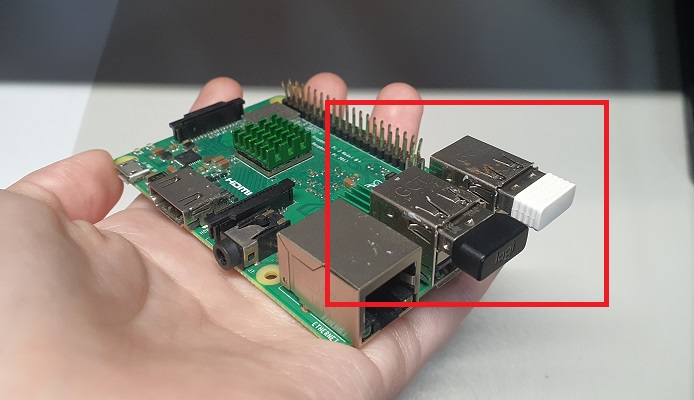
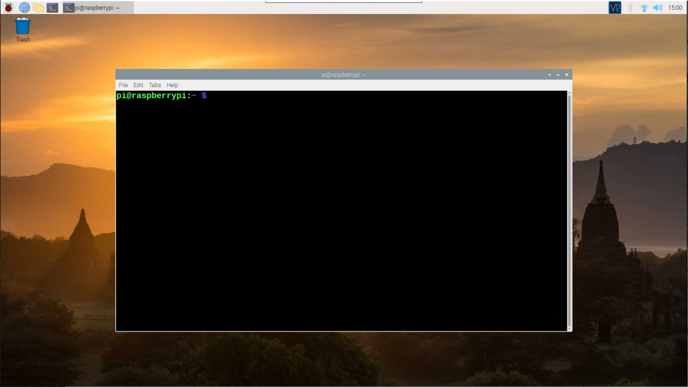
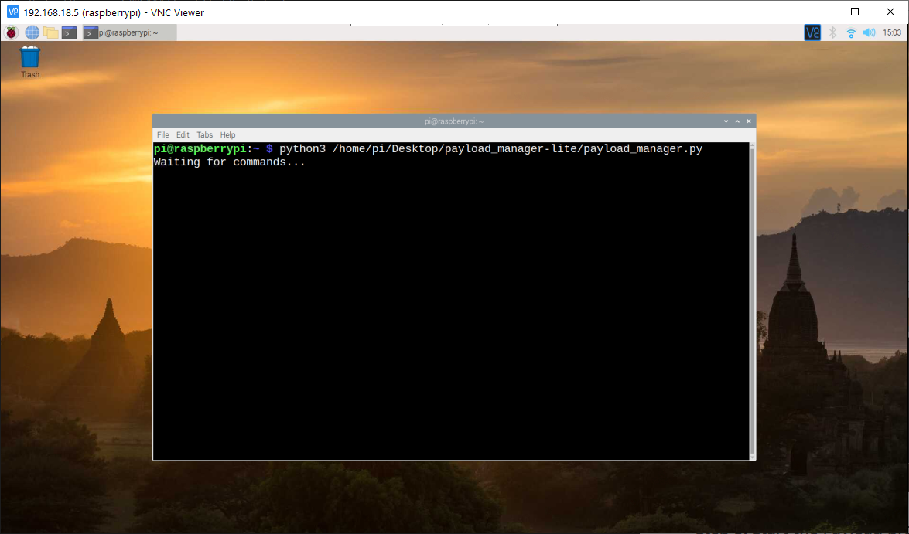

# User Guide - Payload Manager
<!-- markdownlint-disable MD033 -->

This User Guide presents the steps to operate the Payload Manager program on the Raspberry Pi single-board computer.

**Note**: This guide was written in the perspective of a person working in an electronics lab with access to PCs.

## Items Required

Here is a list of items required to run the Payload Manager smoothly.

| Items                               | Remarks                                                                                    |
| ----------------------------------- | ------------------------------------------------------------------------------------------ |
| Raspberry Pi 3B+                    |                                                                                            |
| SanDisk 32 GB Ultra Micro SD Card   |                                                                                            |
| SD Card Reader                      | Optional, depends on PC type so that <br>Micro SD Card may be inserted into PC             |
| Raspberry Pi Micro-USB Power Supply |                                                                                            |
| Monitor                             |                                                                                            |
| HDMI Cable                          | HDMI on one side, and the other side <br>depends on the input required by the Monitor used |
| USB Keyboard                        | Can be wired or wireless                                                                   |
| USB Mouse                           | Can be wired or wireless                                                                   |

Setup and operations best done on a PC that runs on Windows 10.

## Getting Started

### Step 1: Insert the Micro SD card into the Raspberry Pi

The Payload uses a Raspberry Pi 3B+, which is a credit card sized computer.



The Micro SD card comes pre-loaded with the necessary setup to be done to run the Payload and should be already inserted in the Micro SD card slot of the Raspberry Pi 3B+.

The Micro SD card slot is underneath the Raspberry Pi 3B+ as shown in the screenshot below.

The Micro SD card slot is boxed in **<span style="color: red">red</span>** in the screenshot below.



Double check that the Micro SD card is fully inserted into the Micro SD card slot by gently pushing the Micro SD card inwards.

### Step 2: Power up the Raspberry Pi

Power up the Cubesat and the Raspberry Pi according to the hardware guide.

### Step 3: Viewing the Display and controlling the Raspberry Pi

As the Raspberry Pi is a mini computer, there are several ways to access the Raspberry Pi and view the screens like a regular PC.

One way is to directly view the screen by connecting a display monitor to the Raspberry Pi and controlling it with a USB mouse and keyboard.

Plug in a HDMI cable to the Raspberry Pi and connect the HDMI cable to a Monitor.

The HDMI port is boxed in **<span style="color: red">red</span>** in the screenshot below.



Connect the USB keyboard and USB mouse to the Raspberry Pi's USB ports.



Switch to the HDMI source to view the Raspberry Pi GUI.

Upon successful viewing of the GUI, the following screen will show:


## Kickstarting the Payload Programs

### Step 1: Open up the Terminal window

Click on the Terminal icon at the taskbar.

The Terminal icon is boxed in **<span style="color: red">red</span>** in the screenshot below.


The Terminal window will open up, like in the screenshot below.



### Step 2: Start the Payload program

Type the following command exactly into the Terminal window.

```bash
python3 /home/pi/Desktop/payload_manager-lite/payload_manager.py
```

Once the command has run successfully, the Terminal window will display the following output to wait for new Commands from the Cubesat.


