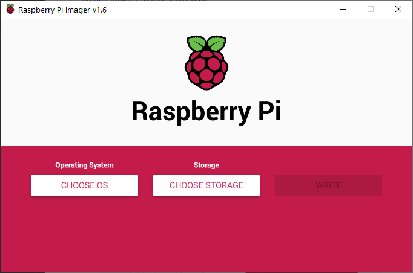
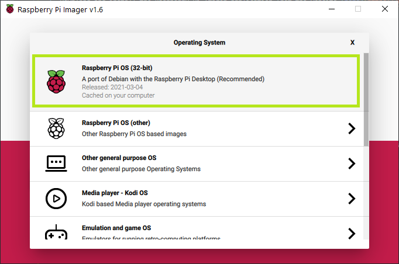
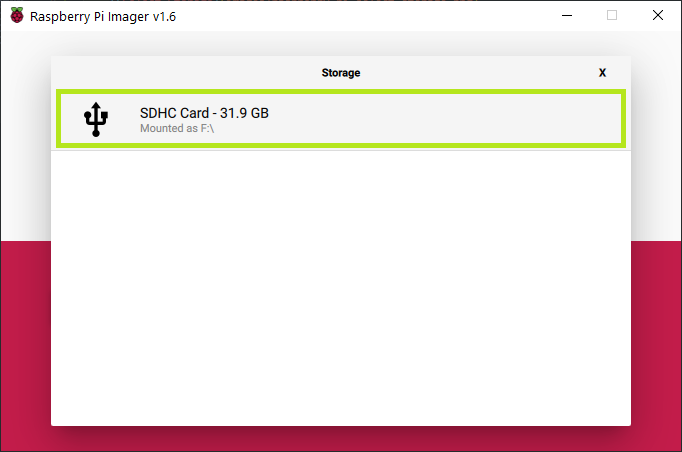
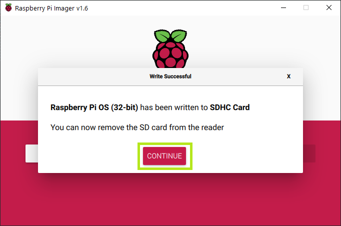
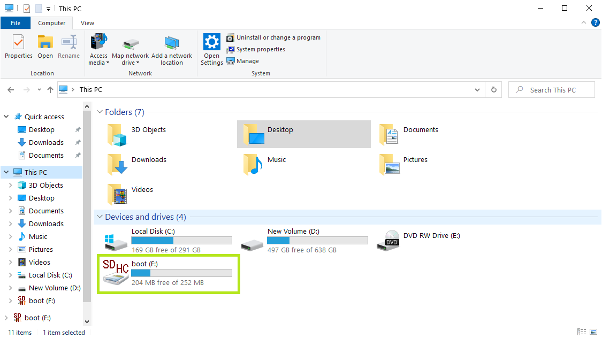

# User Guide - Payload Manager
<!-- markdownlint-disable MD033 -->

This User Guide presents the steps to operate the Payload Manager program on the Raspberry Pi single-board computer.

```bash
python3 /home/pi/Desktop/payload_manager-lite/payload_manager.py
```

## Items required

Here is a list of items required for the mass production of SD Card.

| Items                               | Remarks                                                                                    |
| ----------------------------------- | ------------------------------------------------------------------------------------------ |
| Raspberry Pi 3B+                    |                                                                                            |
| SanDisk 32 GB Ultra Micro SD Card   |                                                                                            |
| SD Card Reader                      | Optional, depends on PC type so that <br>Micro SD Card may be inserted into PC             |
| Raspberry Pi Micro-USB Power Supply |                                                                                            |
| Monitor                             |                                                                                            |
| HDMI Cable                          | HDMI on one side, and the other side <br>depends on the input required by the Monitor used |
| USB Keyboard                        | Can be wired or wireless                                                                   |
| USB Mouse                           | Can be wired or wireless                                                                   |

Setup and operations best done on a PC that runs on Windows 10.

## Step 1: Flashing the Raspbian OS to SD card

1. Download and install the Raspberry Pi Imager application from the website [here](https://www.raspberrypi.org/software/).

    Website: <https://www.raspberrypi.org/software/>

    

2. Launch the Raspberry Pi Imager application.

    The Imager application should look like this:

    

3. Click on the `Choose OS` button under the `Operating System` section.

    The `Choose OS` button is boxed in **<span style="color: lime">green</span>** in the image below.

    

4. Select the first option, `Raspberry Pi OS (32-bit)`.

    The first option `Raspberry Pi OS (32-bit)` is boxed in **<span style="color: lime">green</span>** in the image below.

    

5. Click on the `Choose Storage` button under the `Storage` section.

    The `Choose Storage` button is boxed in **<span style="color: lime">green</span>** in the image below.

    

6. Click on the SD Card storage to flash the OS onto.

    | ⚠️ | **To prevent overwriting your other drives, it is recommended to eject all drives before inserting the SD Card.** |
    | - | -------------------------------------------------------------------------------------- |

    For example, the SD Card detected is shown and boxed  in **<span style="color: lime">green</span>** in the image below.

    

7. Click on the `Write` button to begin the flashing.

    The `Write` button is boxed in **<span style="color: lime">green</span>** in the image below.

    

    Click `Yes` to overwrite the SD Card.

    The `Yes` button is boxed in **<span style="color: lime">green</span>** in the image below.

    

8. Wait for the OS write process to complete.

    Upon completion, click the `Continue` button boxed in **<span style="color: lime">green</span>** in the image below.

    

9. Eject the SD Card and re-insert the SD Card into the PC again.

    Open the `File Explorer` and go to `This PC`.

    A `boot` drive should appear after re-insering the SD Card.

    
