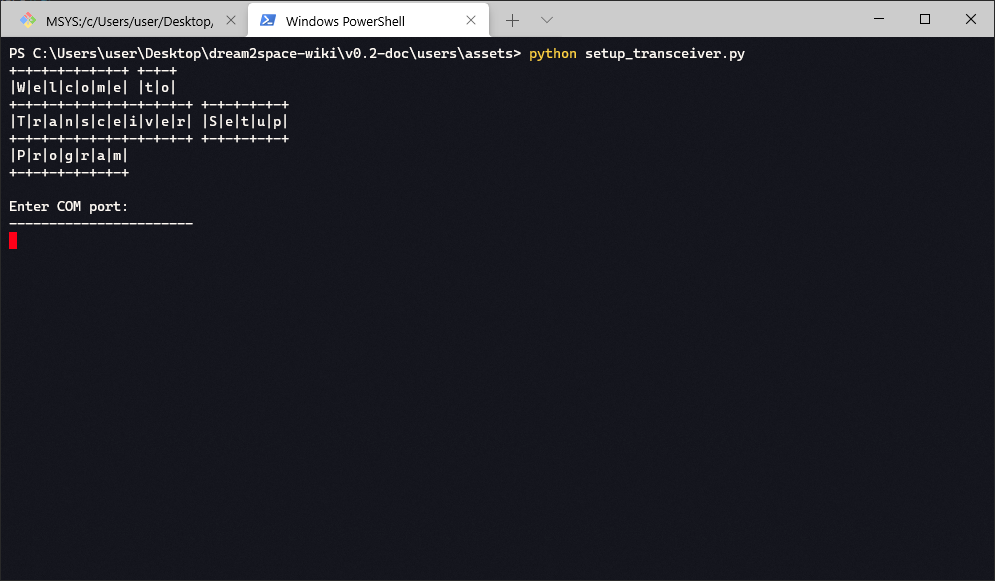

# User Guide - Transceiver Configuration
<!-- markdownlint-disable MD033 -->

This User Guide is meant for persons who are mass producing the transceivers for configuration in use on the dream2space Cubesat.

## Items Required

Here is a list of items required to configure the transceivers per Cubesat.

| Items             | Remarks                                       |
| ----------------- | --------------------------------------------- |
| HC-12 Transceiver | Need 2 per Cubesat                            |
| USB-UART bridge   | Need 2 per Cubesat                            |
| Jumper wires      | To connect the transceiver to USB-UART bridge |
| Laptop            | Requires Python3 installed                    |
| Breadboard        | Suggested nice-to-have item                   |

Setup and operations best done on a PC that runs on Windows 10.

[Datasheet for HC-12](https://statics3.seeedstudio.com/assets/file/bazaar/product/HC-12_english_datasheets.pdf)

## Background Idea

The HC-12 transceiver is a transceiver that operates at a radio frequency of 433.4-473.0 MHz with a step of 400 KHz, amounting to 100 channels in total.

The transceiver configurations are required to allow a pair of transceivers to be able to reach each other at the same frequency channel.

Balancing and allocation of channels are important to fight radio frequency interference between multiple transceivers, which is especially pertinent for the Payload transceiver.

A script is written for easy configuration of the transceivers to their desired radio frequency channels.

## Getting Started

To get started, the transceivers that are to be configured need to be connected to the USB-UART bridge.

This is how the transceiver looks like:


This is how a USB-UART bridge looks like:


Make the following connections between the transceiver and USB-UART bridge using jumper wires and a breadboard.

| USB-UART bridge | Transceiver |
| --------------- | ----------- |
| `5V`            | `Vcc`       |
| `GND`           | `GND`       |
| `TX`            | `RX`        |
| `RX`            | `TX`        |
| `GND`           | `SET`       |

**Note: The `SET` pin of the transceiver needs to be connected to ground to enter AT mode for configuration.**

An example of the transceiver connected to the USB-UART bridge is shown below:


## Configuration

### Step 1: Setup necessary libraries

Open Windows Powershell terminal.

Ensure that Python 3 installed on the PC by typing the following command:

```bash
python --version
```

If Python 3 was installed, the following message will be shown.


Install the following libraries by entering the following command:

```bash
pip install pyserial
```

Download the transceiver setup program <a href="https://dream2space.github.io/dream2space-wiki/setup_transceiver.py" download>here</a>

### Step 2: Label TT&C transceivers

It is important to label the pair of transceivers that will be used for the TT&C before proceeding with the configuration.

An example of the labelling is done as shown in the screenshot below.


### Step 3: Label Payload transceiver

Similarly, label the pair of transceivers that will be used for the Payload before proceeding with the configuration.

An example of the labelling is done as shown in the screenshot below.


### Step 4: Configure TT&C transceiver

To configure the transceiver, run the transceiver setup program by entering the command:

```bash
python3 setup_transceiver.py
```

The program will start running and the Powershell terminal will show the a Welcome banner as shown in the screenshot below.



Enter the `COM` port as instructed and adhere to the format `COMXX`, where `XX` is the port number.

An example and the output is shown in the screenshot below.


Next, enter `1` to configure a TT&C transceiver.

An example and the output is shown in the screenshot below.


Enter the channel that the TT&C transceivers will communicate in and adhere to the format as instructed by the program.

The program will attempt to configure the transceiver and if it is successful, a success message will be

An example and the output is shown in the screenshot below.


Once successful, repeat the step for the other transceiver of the transceiver pair.

If the program is unable to communicate with the transceiver, the error message will be shown as follows.


Here are some tips to troubleshoot before repeating the step for the current transceiver:

1. Check the connection of the `SET` pin - ensure it is connected to `GND`.

2. Ensure that the USB-UART bridge is inserted into the PC.

3. Double check the connections between the USB-UART bridge and transceiver for any loose connections.

### Step 5: Configure Payload transceiver

To configure the transceiver, run the transceiver setup program by entering the command:

```bash
python3 setup_transceiver.py
```

The program will start running and the Powershell terminal will show the a Welcome banner as shown in the screenshot below.


Enter the `COM` port as instructed and adhere to the format `COMXX`, where `XX` is the port number.

An example and the output is shown in the screenshot below.


Next, enter `2` to configure a Payload transceiver.

An example and the output is shown in the screenshot below.


Enter the channel that the TT&C transceivers will communicate in and adhere to the format as instructed by the program.

The program will attempt to configure the transceiver and if it is successful, a success message will be

An example and the output is shown in the screenshot below.


Once successful, repeat the step for the other transceiver of the transceiver pair.

If the program is unable to communicate with the transceiver, the error message will be shown as follows.


Here are some tips to troubleshoot before repeating the step for the current transceiver:

1. Check the connection of the `SET` pin - ensure it is connected to `GND`.

2. Ensure that the USB-UART bridge is inserted into the PC.

3. Double check the connections between the USB-UART bridge and transceiver for any loose connections.
