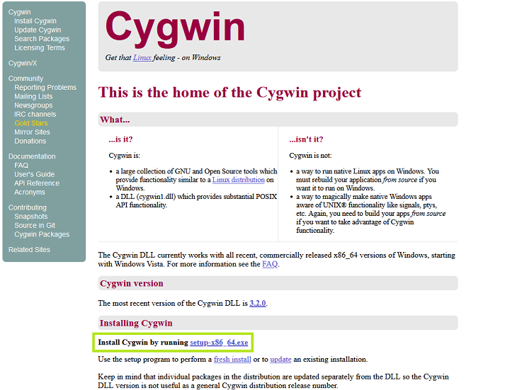
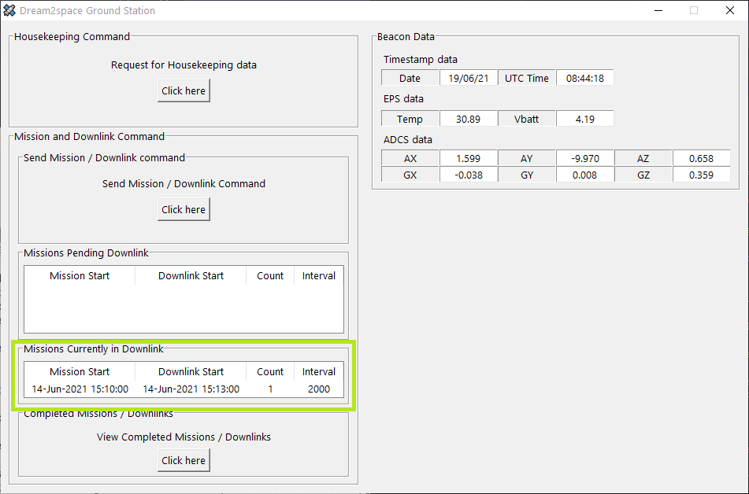
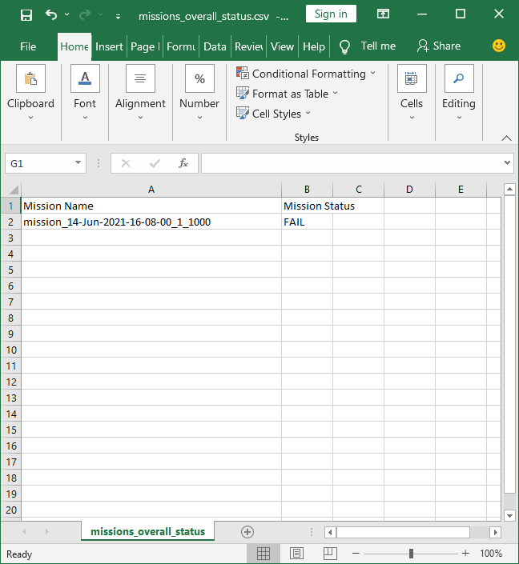
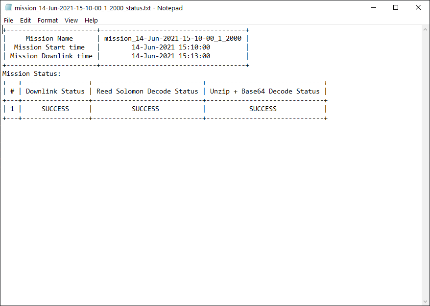

# User Guide - Dream2space Cubesat Ground Station
<!-- markdownlint-disable MD033 -->

The Dream2space GUI Ground Station allows you to interact with your Dream2space Cubesat.

The Ground Station app is currently on available on Windows Operating System.

<!-- markdownlint-disable MD025 MD003 -->
Contents
========
<!-- markdownlint-enable MD025 MD003 -->

- [Prerequisites](#prerequisites)
  - [Step 1: Visit the Cygwin website](#step-1-visit-the-cygwin-website)
  - [Step 2: Download Cygwin installer](#step-2-download-cygwin-installer)
  - [Step 3: Install Cygwin](#step-3-install-cygwin)
- [Getting Started](#getting-started)
  - [Step 1: Download the Ground Station app](#step-1-download-the-ground-station-app)
  - [Step 2: Setup the Ground Station transceivers](#step-2-setup-the-ground-station-transceivers)
  - [Step 3: Connect the TTnC transceiver to the Computer](#step-3-connect-the-ttnc-transceiver-to-the-computer)
  - [Step 4: Connect the Payload transceiver to the Computer](#step-4-connect-the-payload-transceiver-to-the-computer)
  - [Step 5: Open up the Ground Station app](#step-5-open-up-the-ground-station-app)
- [Configuring the Ground Station app](#configuring-the-ground-station-app)
  - [Step 1: Select the TTnC COM port](#step-1-select-the-ttnc-com-port)
  - [Step 2: Select the Payload COM port](#step-2-select-the-payload-com-port)
  - [Step 3: Confirm and Start running app](#step-3-confirm-and-start-running-app)
- [Ground Station Beacon Panel](#ground-station-beacon-panel)
- [Ground Station Housekeeping Data Panel](#ground-station-housekeeping-data-panel)
  - [Step 1: Send the Housekeeping Command](#step-1-send-the-housekeeping-command)
  - [Step 2: Navigate to location where logs are saved](#step-2-navigate-to-location-where-logs-are-saved)
- [Ground Station Mission Panel](#ground-station-mission-panel)
  - [Step 1: Open Mission Command window](#step-1-open-mission-command-window)
  - [Step 2: Fill in Mission Start date and time](#step-2-fill-in-mission-start-date-and-time)
  - [Step 3: Fill in Mission images and interval](#step-3-fill-in-mission-images-and-interval)
  - [Step 4: Fill in Downlink Start date and time](#step-4-fill-in-downlink-start-date-and-time)
  - [Step 5: Send the Mission command](#step-5-send-the-mission-command)
  - [Step 6: Waiting for Mission to be executed](#step-6-waiting-for-mission-to-be-executed)
  - [Step 7: Waiting for Downlink to be completed](#step-7-waiting-for-downlink-to-be-completed)
  - [Step 8: Viewing status of Missions](#step-8-viewing-status-of-missions)
  - [Step 9: Viewing Mission status and images](#step-9-viewing-mission-status-and-images)

## Prerequisites

This step is needed if you are using a computer that runs on a **Windows** operating system.

The Ground Station app requires an additional software **Cygwin** to run.

### Step 1: Visit the Cygwin website

To download Cygwin, click the link [here](https://www.cygwin.com/).

Link to download Cygwin: <https://www.cygwin.com/>

The Cygwin page should look like this:

### Step 2: Download Cygwin installer

Click on the link `setup-x86_64.exe` to download the Cygwin installer, as shown in the **green** box in the screenshot above.

### Step 3: Install Cygwin

Proceed to install Cygwin using the installer.

When prompted to choose Installation Directory, ensure that the Root Directory is `C:\cygwin64`.

The step and the correct Root Directory is shown in the **green** box in the screenshot below.

## Getting Started

### Step 1: Download the Ground Station app

To begin, download the Ground Station app.

Download the latest version of the Ground Station app `Ground_Station.exe` from the `Releases` page [here](https://github.com/dream2space/dream2space-ground_station/releases/tag/v1.0).

Link to download Ground Station app: <https://github.com/dream2space/dream2space-ground_station/releases/tag/v1.0>

The `Releases` page should look like this:

You can find the latest version of the Ground Station app and the Version tag in the table below.

| Executable Name      | Version Number |
| -------------------- | -------------- |
| `Ground_Station.exe` | `v1.0`         |

Scroll down to view the download link of the `Ground_Station.exe` app.

The download link of the `Ground_Station.exe` app is boxed in **green** box in the screenshot below.

Click on the `Ground_Station.exe` under the `Assets` section to download it.

### Step 2: Setup the Ground Station transceivers

The Ground Station has two 433 MHz transceivers to communicate with the TT&C and the Payload of the Dream2space cubesat respectively.

This is how a transceiver looks like:

The transceiver uses the Universal asynchronous receiver-transmitter (UART) protocol to send data to and from the transceiver.

As most computers are unable to communicate via UART directly, a USB-UART bridge to connect the transceiver to the computer's USB ports.

This is how a USB-UART bridge looks like:

An example of the transceiver connected to the USB-UART bridge that you have received is shown below:

Double check that the pin connections are done as shown in the table below:

| USB-UART bridge | Transceiver |
| --------------- | ----------- |
| `5V`            | `Vcc`       |
| `GND`           | `GND`       |
| `TX`            | `RX`        |
| `RX`            | `TX`        |

| 💡 | This table is also a handy reference if connections are removed by mistake! |
| -- | --------------------------------------------------------------------------- |

### Step 3: Connect the TTnC transceiver to the Computer

| ⚠️ | **The sequence of plugging in the USB-UART bridges is important. Do try to follow the sequence.** |
| - | ------------------------------------------------------------------------------------------------ |

The computer identifies the USB-UART bridges as virtual `COM` ports and each bridge is assigned a unique `COM` port number upon plugging in the USB.

The Ground Station app needs to know `COM` port number for the TT&C and Payload transceiver to read and write to the respective transceivers.

The TT&C transceiver comes with a label on the transceiver, as shown in the image below.

Plug in the TT&C transceiver's USB-UART bridge into the computer. The computer should detect the USB `COM` port and the `COM` port can be found using the Device Manager.

Note down the `COM` port for the TT&C transceiver's USB-UART bridge.

### Step 4: Connect the Payload transceiver to the Computer

| ⚠️ | **The sequence of plugging in the USB-UART bridges is important. Do try to follow the sequence.** |
| - | ------------------------------------------------------------------------------------------------ |

The payload transceiver comes with a label on the transceiver, as shown in the image below.

Plug in the Payload transceiver's USB-UART bridge into the computer. The computer should detect the USB `COM` port and the `COM` port can be found using the Device Manager.

Note down the `COM` port for the Payload transceiver's USB-UART bridge.

### Step 5: Open up the Ground Station app

| ⚠️ | **This is the recommended way to open up the GUI exe. Other methods may cause errors.** |
| - | --------------------------------------------------------------------------------------- |

Navigate to the folder containing the downloaded GUI exe, as shown in the folder below.

Double click on the icon to launch the app. The icon is boxed in **green** in the the screenshot below.

If the app has launched successfully, the Start Page, as shown in screenshot below, will appear.

A `dream2space` folder will also be created in the same folder to store data collected from the app.

The folder is boxed in **green** in the screenshot below.

| ⚠️ | **Do not delete that folder while the app is running!** |
| - | ------------------------------------------------------ |

## Configuring the Ground Station app

| 💡 | TIP! |
| -- | ---- |

If you cannot spot the `COM` ports noted down in previous steps, try clicking on the **🔄 Refresh** button.

The **🔄 Refresh** button is boxed in **green** in the screenshot below.

The **🔄 Refresh** button will scan and reload the available `COM` ports again.

### Step 1: Select the TTnC COM port

To view the list of `COM` ports available for selection as the TT&C transceiver's port, click on the dropdown menu.

The dropdown menu is boxed in **green** in the screenshot below.

The list of discovered `COM` ports will be displayed.

Select the `COM` port that you have noted down after plugging in the TT&C transceiver's USB-UART bridge.

### Step 2: Select the Payload COM port

To view the list of `COM` ports available for selection as the Payload transceiver's port, click on the dropdown menu.

The dropdown menu is boxed in **green** in the screenshot below.

The list of discovered `COM` ports will be displayed.

Select the `COM` port that you have noted down after plugging in the Payload transceiver's USB-UART bridge.

### Step 3: Confirm and Start running app

After selecting `COM` ports for the TT&C and Payload transceivers, click on the Start button to proceed.

The Start button is boxed in **green** in the screenshot below.

After which, the app will display the Ground Station main page as shown below.

## Ground Station Beacon Panel

Every minute, the Dream2space Cubesat will send beacons to advertise its presence.

The Ground Station will pick up the beacons to display it in the Beacon panel of the Ground Station.

The Beacon panel is boxed in **green** in the screenshot below.

The Beacon panel display will blink in **yellow** to indicate a new beacon has arrived in the Ground Station.

## Ground Station Housekeeping Data Panel

The Ground Station is capable of sending commands to the Dream2space Cubesat to retrieve Housekeeping data stored onboard.

Housekeeping data refers to sensor data collected by the On-board Computer (OBC).

The steps below show how to retrieve Housekeeping data from the Dream2space Cubesat.

### Step 1: Send the Housekeeping Command

To send a Housekeeping command, click on the button to request for Housekeeping data.

The button is boxed in **green** in the screenshot below.

After the Housekeeping command request button is clicked, the Housekeeping command will be sent to the Dream2space Cubeat.

While the command is being sent, the progress bar will be shown.

To ensure that the Housekeeping command is sent without disruption, all commands sending will be disabled.

Once the Ground Station receives a response from the Dream2space Cubesat **successfully** (after approximately 5 seconds), the Housekeeping Data panel will indicate with a success message.

Upon seeing the success message, proceed to Step 2.

The success message is boxed in **green** in the screenshot below.

If the progress bar still appears after 10 seconds, the operation is likely to have failed and an error message will be shown.

The error message is boxed in **red** in the screenshot below.

To retrieve Housekeeping data, send the Housekeeping command again as described in Step 1.

### Step 2: Navigate to location where logs are saved

After the response containing Housekeeping data is successfully received by the Ground Station, the Ground Station will process, save into Comma Separated Values (CSV) log files and pop up the Explorer window showing the folder containing the CSV file.

The CSV file is saved in the `dream2space/housekeeping_data` folder.

For instance, the screenshot below shows the Explorer window popped up after a successful Housekeeping data retrieval operation.

Click on the CSV file and the CSV file will contain the Housekeeping data received, as shown in the screenshot below.

## Ground Station Mission Panel

The Ground Station is capable of sending Mission commands to the Dream2space Cubesat to capture images and transmitting them down to the Ground Station for storage.

The steps below show how to send a Mission command and receive images via downlink from the Dream2space Cubesat.

### Step 1: Open Mission Command window

Click on the button to send a Mission/Downlink command.

The button is boxed in **green** in the screenshot below.

A Mission command window will pop up, as shown in the screenshot below.

### Step 2: Fill in Mission Start date and time

Fill in the Mission Start date and time in the `Mission Start Date` and `Mission Start Time` panels.

There are some rules that the Mission Start date and time needs to adhere to:

  1. The Mission Start date and time must be in the future.

  2. It is recommended to be at least 2 minutes from the current time.

  3. The Mission Start time must not be less than 15 seconds before or after an already scheduled Mission.

  4. There can only be at most 3 incomplete missions at any time.

The `Mission Start Date` and `Mission Start Time` panels are boxed in **green** in the screenshot below.

### Step 3: Fill in Mission images and interval

Fill in the number of image to be taken in the mission in the `Mission Image Count` panel and the interval between each image in the `Mission Image Interval` panel.

The `Mission Image Count` and `Mission Image Interval` panels are boxed in **green** in the screenshot below.

In each field, there are some allowed values that these mission parameters are allowed to take.

The table below shows the values allowed for the `Mission Image Count` and the `Mission Image Interval` field.

| Field                    | Units | Min    | Max    |
| ------------------------ | ----- | ------ | ------ |
| `Mission Image Count`    | N/A   | `1`    | `3`    |
| `Mission Image Interval` | ms    | `1000` | `5000` |

Use the arrows to select the values to input for each mission parameter.

### Step 4: Fill in Downlink Start date and time

Fill in the Downlink Start date and time in the `Downlink Start Date` and `Downlink Start Time` panels.

There are some rules that the Downlink Start date and time needs to adhere to:

  1. The Downlink Start date and time must be in the future.

  2. The Downlink Start date and time must be after the Mission Start date and time.

  3. The Downlink Start date and time must not be less than 10 minutes before or after an already scheduled Downlink.

The `Mission Start Date` and `Mission Start Time` panels are boxed in **green** in the screenshot below.

### Step 5: Send the Mission command

To send the mission command, click on the Submit button.

The Submit button is boxed in **green** in the screenshot below.

### Step 6: Waiting for Mission to be executed

After the Submit button is clicked, the Mission command will be sent to the Dream2space Cubeat.

While the command is being sent, the progress bar will be shown.

To ensure that the Housekeeping command is sent without disruption, all commands sending will be disabled.

After the mission command is sent, a mission record is kept in the `Missions Pending Downlink` panel.

The record will be stored here until 2 minutes before the Downlink time of the Mission.

An example of a mission record in the `Missions Pending Downlink` panel is boxed in **green** in the screenshot below.

### Step 7: Waiting for Downlink to be completed

When a mission is 2 minutes away from its Downlink time, the Ground Station will enter standby mode to wait for the downlink of images.

When this happens, the mission record will be shifted from the `Missions Pending Downlink` panel to the `Missions Currently in Downlink` panel.

An example of a mission record in the `Missions Currently in Downlink` panel is boxed in **green** in the screenshot below.

The mission record will remain there until the completion of downlink, error correction and decoding and of images collected (if successful).

### Step 8: Viewing status of Missions

After the completion of downlink, the mission record will be removed from the `Missions Currently in Downlink` panel.

To view the overall status of the mission, click on the button to view completed mission/downlink operations.

The button is boxed in **green** in the screenshot below.

Clicking on the button opens up a CSV file containing the status records of all missions executed.

The table below describes what it means for an operation to be successful or have failed:

| Status    | Meaning                                                                                                                   |
| --------- | ------------------------------------------------------------------------------------------------------------------------- |
| `SUCCESS` | All the process (Downlink, Error correction with Reed-Solomon, Decoding/Processing of images) are completed successfully. |
| `FAILED`  | One of the above mentioned processes have failed.                                                                         |

The screenshot below shows an example if the status if the mission was successful.

The screenshot below shows an example if the status if the mission has failed.

### Step 9: Viewing Mission status and images

Clicking on the button also opens up an explorer to view the list of folders where mission images are stored in.

Click on the folder containing the executed mission to view the contents.

For example, the folder with the mission previously executed is boxed in **green** in the screenshot below.

If the mission was successful, the recovered images will be found in the folder.

A text file log of the detailed mission status will also be found in the folder.

Opening the text log file will show the status of each process that the Ground Station undertakes to recieve, perform error correction and decode the image.

This is important in the scenario to find out what is wrong in the downlink process.

For example, the logs below show that the decoding of the images using Base64 has failed.

This is useful for debugging and troubleshooting the connections and transmission between the Cubesat and the Ground Station.
